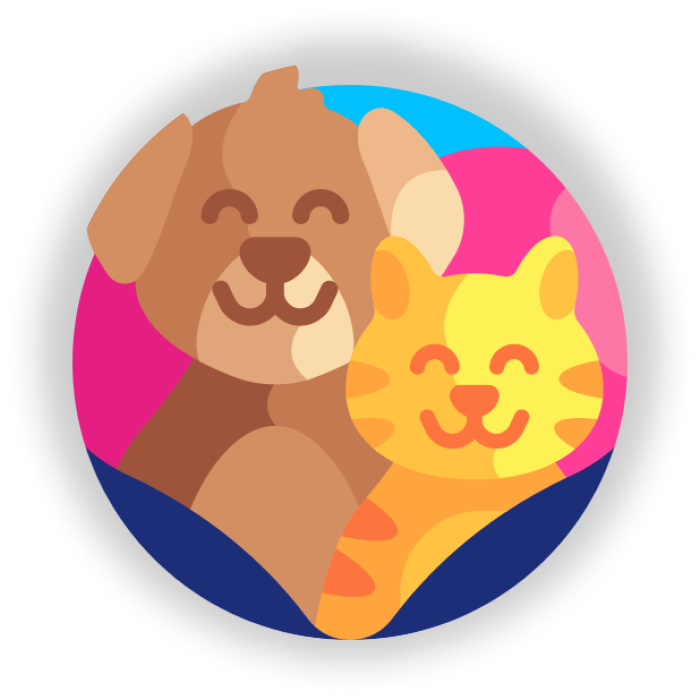

  
  <h3>FofurinhasPetShop WebApp</h3>
  <h4>RM99632 - Gabriel Eringer de Oliveira</h4>

  
  
  

## 📋 Índice
* [Índice](#indice)
* [Tecnologias utilizadas](#tecnologias-utilizadas)

## ✔️ Tecnologias utilizadas
- ``Visual Studio Professional 2022 - v.17.6.3``
- ``ASP.NET Core Web App (Model-View-Controller)``
